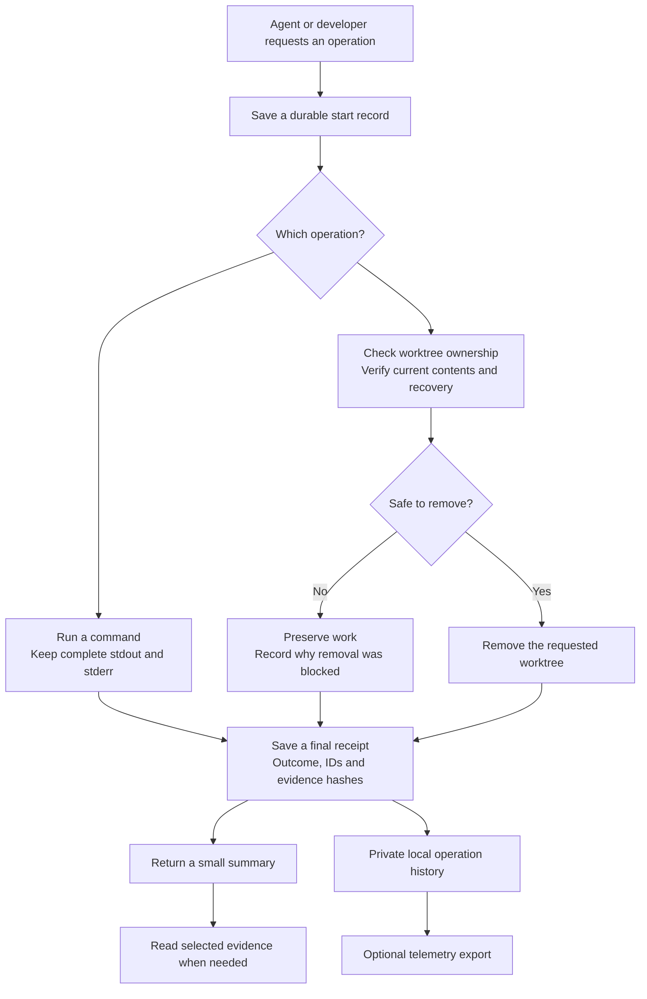
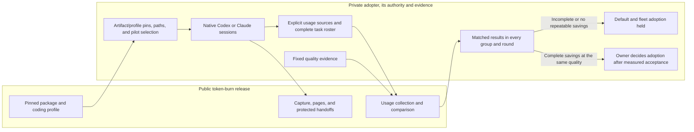
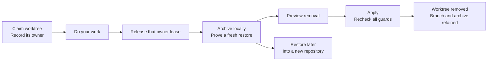
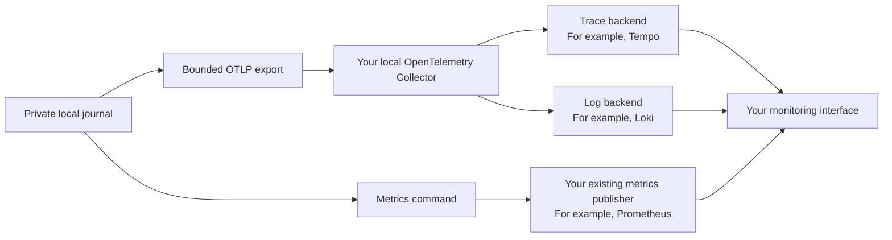

# token-burn

**Keep complete evidence. Give your agent a small summary. Recover work before cleanup.**

Coding agents can fill their context with logs, rerun commands to find missing output,
or lose useful work during cleanup. **token-burn** is a small Python toolkit that keeps
the full evidence on your machine and returns the useful facts first.

It works with any agent, script, or developer that can run a command. No RAGnos account,
cloud service, model API, or monitoring stack is required. Network export is **off by default**.

> **Status: 0.0.12 alpha.** Local evidence, operation history, explicit Git recovery,
> native usage comparison, bounded handoffs, and a released coding profile are
> implemented. Native workflow adoption and token savings require separate evidence.

- [Try it](#try-it)
- [How it works](#how-it-works)
- [What you get](#what-you-get)
- [Recover work before cleanup](#recover-work-before-cleanup)
- [Optional observability](#optional-observability)
- [Use it in your own tools](#use-it-in-your-own-tools)
- [Measure complete tasks](#measure-complete-tasks)
- [Limits and privacy](#limits-and-privacy)

## Try it

Requires **Python 3.11+ on macOS or Linux**. Git is required for the Git recovery
commands and for installation directly from this repository.

```bash
python3 -m venv .venv
. .venv/bin/activate
python -m pip install "git+https://github.com/ragnos-labs/token-burn.git@v0.0.12"

# Keep the output directory outside your repository.
DEMO_ROOT=$(mktemp -d)
token-burn capture --output-dir "$DEMO_ROOT/run" -- \
  python -c 'for i in range(1000): print("diagnostic line", i)'

# Inspect a small page of the saved output. The command does not run again.
token-burn read "$DEMO_ROOT/run/stdout.log" --limit-bytes 300
```

The first command saves all 1,000 lines and prints a bounded JSON summary. Your
agent can see the exit status, output sizes, hashes, and operation ID immediately.
When it needs details, it reads a page from the saved file.

The evidence directory contains:

```text
run/
├── stdout.log             # Original stdout bytes
├── stderr.log             # Original stderr bytes
├── receipt.json           # Exit status, sizes, hashes and operation reference
└── operation-status.json  # Whether terminal history and export succeeded
```

Use a new output directory for each run. Existing directories are refused before
the command starts. A normal completed capture preserves the command's exit code.

## How it works



**Local evidence is the foundation.** A collector outage does not erase command
output or turn a failed operation into a success. Export delivery is reported
separately from the operation's result.

## What you get

| Capability | What it does | Why it helps |
|---|---|---|
| Command capture | Retains stdout, stderr, exit status and hashes | Inspect evidence without repeating the command |
| Case reports | Saves every supplied case result and failure | Small summaries do not hide failures beyond the preview |
| Bounded reads | Returns a byte page and the next cursor | Bring only the needed detail into the agent's context |
| Operation history | Records start, stages and terminal outcome | Distinguish completed, failed, blocked and cancelled work |
| Git recovery | Saves Git history, staged changes and working file bytes | Restore work into a fresh independent repository |
| Removal guards | Recheck owner, target, contents, recovery and process activity | Changed or uncertain state preserves the worktree |
| Optional telemetry | Exports fixed metadata through a local OTLP collector | Connect operations to your existing observability stack |
| Native usage | Counts explicitly selected Codex or Claude usage, including retries | Compare whole tasks without dropping failures or treating missing usage as zero |
| Bounded handoffs | Preserves protected task state and evidence references | Resume from a small validated packet |
| Released coding profile | Provides a short resource with a version and digest | Use the same working habits through a released pin |

## Measure complete tasks

```bash
token-burn usage collect --sources sources.json --state-dir /private/usage-state --output usage.json
token-burn usage compare --baseline baseline.json --candidate candidate.json \
  --outcomes outcomes.json --output comparison.json
token-burn handoff create --input task-state.json --output handoff.json
token-burn handoff validate handoff.json
token-burn profile show --json
```

Supply an explicit task roster and native source files. Freeze the task, model,
reasoning, validation, and repository revision across baseline and candidate.
Keep retries, children, continuations, and failed attempts in their original task.
Comparison requires complete usage and the same accepted quality, with repeatable
improvement in every declared client/repository group. It never pools different
clients' tokenizers into a single savings ratio or installs the profile for you.



**Measured results:** Native paired savings are currently unavailable. No default
or fleet adoption has been accepted. Source tests and synthetic fixtures do not
establish those outcomes.

See [the exact schemas, privacy limits, and Python interfaces](docs/efficiency.md).
The offline [synthetic example](examples/efficiency_demo.py) exercises the flow
without a model account. Its generated comparison is a fixture, not token-savings
evidence. Run it with a new output directory:

```bash
python examples/efficiency_demo.py --output-dir /private/synthetic-efficiency-demo
```

```bash
token-burn --help
token-burn status RUN_ID
token-burn history RUN_ID --limit 20
token-burn snapshot
```

The evidence-summary budget defaults to **6,000 serialized bytes**, adjustable with
`--summary-bytes`. Full output remains in the evidence files. A smaller capture
summary can reduce tool output read by an agent; that fact alone does not establish
whole-task token or cost savings. Use native usage collection and fixed-quality
matched comparisons to measure total work, including retries and continuations.

## Recover work before cleanup

This is an explicit workflow for **one linked Git worktree**. It does not scan a
fleet, delete branches, push to remotes, or clean up your primary checkout.

Want to see the full flow with disposable data? From a clone of this repository,
run `python examples/worktree_demo.py --output-dir /tmp/token-burn-demo-new`.
It creates its own tiny repository, preserves two different versions of a file,
removes the worktree, and proves both versions were restored. The output directory
must be new; the demo keeps its evidence there for inspection.



Run these commands from **outside** the target worktree. A shell or process with
a working directory inside the target blocks removal.

```bash
# Before starting work: record the owner and keep the returned lease_id.
token-burn worktree claim /path/to/linked-worktree --owner my-task

# When that owner has finished, release its exact lease.
token-burn worktree release /path/to/linked-worktree --lease-id LEASE_ID

# Save locally, including distinct staged and working versions.
token-burn worktree archive /path/to/linked-worktree \
  --output-dir /path/to/private/recovery-001

# Preview. Nothing is removed without --apply.
token-burn worktree remove /path/to/linked-worktree \
  --archive /path/to/private/recovery-001

# Perform a fresh guarded removal.
token-burn worktree remove /path/to/linked-worktree \
  --archive /path/to/private/recovery-001 --apply

# Recovery works without the original checkout or a remote server.
token-burn worktree restore /path/to/private/recovery-001 \
  --destination /path/to/new-restored-repository
```

If the lease, target, staged changes, working bytes, file modes, or archive change,
the old evidence cannot authorize removal. Missing ownership information, hidden
index state, Git locks, active processes, and incomplete process scans also hold
the worktree in place. An expired or abandoned task is **not** automatic permission
to remove it.

Restoration uses a private Git bundle plus verified file payloads. Creating the
archive preserves the original HEAD and index. Restore destinations must be new.
Archives include tracked files even when Git reports them as clean, plus untracked
and ignored files. Defaults are 10,000 file paths and 512 MiB;
the CLI exposes explicit overrides. See [recovery details](docs/recovery.md).

## Optional observability

The local workflow works without a collector. If you already use OpenTelemetry,
connect token-burn to an explicitly configured **loopback** OTLP/HTTP receiver:

```bash
export TOKEN_BURN_OTEL_ENABLED=1
export TOKEN_BURN_OTLP_ENDPOINT=http://127.0.0.1:4318

token-burn replay RUN_ID --max-seconds 3
token-burn metrics
```

Replay sends retained telemetry. **It never reruns the command or removal.**
`metrics` prints Prometheus text; it does not start a server or install a scheduler.



The collector owns remote authentication and backend routing. token-burn does not
load provider credentials, follow redirects, or use system HTTP proxies.
The [OpenTelemetry Collector](https://opentelemetry.io/docs/collector/) can route
these signals to open-source or commercial backends.

**Collector acceptance is not proof of backend storage.** Retryable delivery stays
pending; permanent or partial rejection stays held. See
[telemetry setup and verification](docs/telemetry.md) and the [collector example](examples/otel-collector.yaml).

## Use it in your own tools

```python
from pathlib import Path
from token_burn.evidence import capture, summary

receipt = capture(["python", "-m", "pytest", "-q"], Path("/private/evidence/check-001"))
print(summary(receipt))
```

| Integration | What the application owns | What token-burn provides |
|---|---|---|
| Agent or command runner | Which commands are authorized | Capture, receipts and bounded reads |
| Repository manager | Which worktree is approved for removal | Recovery verification and local removal guards |
| Existing ownership service | Current owner, generation and release facts | An `Authority` interface for checking those facts |
| Dashboard or controller | User interface and operational decisions | Versioned outcomes, freshness and opaque trace references |

The Python API is documented in [integration contracts](docs/integrations.md).
Capture inherits the command's ordinary permissions and environment; it is not a sandbox.

**For RAGnos users:** Workspace still owns its existing implementation and fleet
policy. Adopting this package is a separate migration. A future Controller
integration should read bounded, versioned status and trace references. This
release does not modify either product or activate production monitoring.

## Limits and privacy

- Full output and recovery archives stay local and may contain sensitive data.
  Store them outside Git, prompt ingestion, and shared telemetry. Private file
  permissions are not encryption.
- Exported events use fixed operation, stage, reason and outcome codes, opaque
  IDs, and digests. They exclude command arguments, prompts, raw output, branch
  names, private paths and credentials.
- SIGINT/SIGTERM capture stops descendants in its process group. A process that
  creates a new session is outside that scope. SIGKILL, crashes, and storage failure
  can prevent a terminal receipt.
- Locks and leases coordinate cooperating callers. They cannot freeze a filesystem
  or fence an unrelated writer between the last check and deletion.
- Git recovery supports ordinary complete linked worktrees. Submodules, sparse or
  hidden index state, shallow/partial clones, alternate object stores, and locally
  configured Git command filters are held.
  File contents, staging and file modes are covered; ACLs, extended attributes,
  directory metadata and empty untracked directories are outside the contract.
- Case summaries report the producer's supplied pass/fail assertions. They do not
  independently judge whether a test or task was correct.

See [SECURITY.md](SECURITY.md) for trust boundaries and vulnerability reporting.

## Develop and contribute

```bash
git clone https://github.com/ragnos-labs/token-burn.git
cd token-burn
uv sync --group dev
uv run ruff check src tests
uv run pytest
uv build
```

Tests use disposable repositories, private temporary journals, real subprocesses,
and local HTTP fixtures. Runtime code uses the Python standard library. No hosted
CI or paid service is required to run the validation.

See [CONTRIBUTING.md](CONTRIBUTING.md), [release validation](docs/validation.md),
and [CHANGELOG.md](CHANGELOG.md). Licensed under [Apache-2.0](LICENSE).

```text
src/token_burn/
├── evidence.py     # Capture, case reports and bounded file reads
├── operations.py   # Durable journals and bounded OTLP export
├── monitor.py      # Local inventory and metrics
├── scope.py        # One operation across nested calls
└── worktree/       # Ownership interface, archives, restore and removal guards
tests/              # Synthetic process, Git, recovery and HTTP checks
examples/           # Local usage and optional collector/alert configuration
docs/               # Detailed contracts and validation
```
